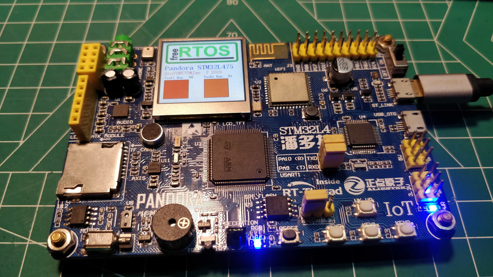

# FreeRTOS_STM32L4

[**English**|[简体中文](./README_ZH.md)]

## Introduction

FreeRTOS Study Note &amp;&amp; Project

> based on **ALIENTEK@STM32L4 Pandora Developement Board V2.51**, **FreeRTOS V10.0.1**

## Files Description

>Files tree
.
├── FreeRTOS    # FreeRTOS Source code
│   └── FreeRTOSv10.2.1_191129
│       ├── FreeRTOS
│       ├── FreeRTOS-Labs
│       └── FreeRTOS-Plus
├── docs    # FreeRTOS Study Note
├── freertos_examples # FreeRTOS Study Project
│   ├── 2-1.led_sample
│   │   ├── BSP
│   │   ├── FREERTOS-CONFIG
│   │   └── MDK-ARM
│   ├── Drivers
│   │   ├── CMSIS
│   │   └── STM32L4xx_HAL_Driver
│   ├── freertos_kernel
│   │   ├── include
│   │   └── portable
│   └── utils
│       └── include
└── img

### projects

| No. | project | Description |
|---|---|---|
|1.| [2-1.led_sample](./freertos_examples/2-1.led_sample) | **FreeRTOS** porting example. |
|---|---|---|
