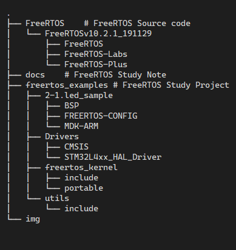

# FreeRTOS_STM32L4

[[English](./README.md)|**简体中文**]

## 摘要

FreeRTOS 学习笔记 &amp;&amp; 工程代码

> 基于 ALIENTEK@STM32L4 Pandora V2.51 开发板, FreeRTOS V10.0.1 版本

## 工程文件描述

目录树

> 

### 工程代码

| No. | 工程 | 描述 |
|---|---|---|
|1.| [2-1.led_sample](./freertos_examples/2-1.led_sample) | **FreeRTOS** 移植例程. |
|---|---|---|
