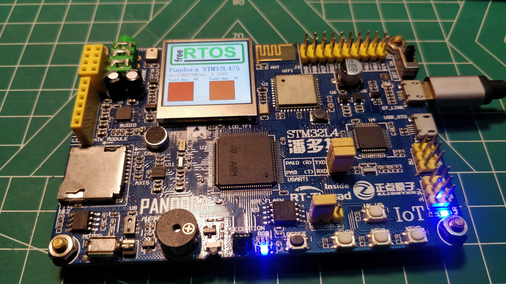

# FreeRTOS_STM32L4

[[English](./README.md)|**简体中文**]

## 摘要

FreeRTOS 学习笔记 &amp;&amp; 工程代码

> 基于 ALIENTEK@STM32L4 Pandora V2.51 开发板, FreeRTOS V10.0.1 版本

## 工程文件描述

>目录树
.
├── FreeRTOS    # FreeRTOS Source code
│   └── FreeRTOSv10.2.1_191129
│       ├── FreeRTOS
│       ├── FreeRTOS-Labs
│       └── FreeRTOS-Plus
├── docs    # FreeRTOS Study Note
├── freertos_examples # FreeRTOS Study Project
│   ├── 2-1.led_sample
│   │   ├── BSP
│   │   ├── FREERTOS-CONFIG
│   │   └── MDK-ARM
│   ├── Drivers
│   │   ├── CMSIS
│   │   └── STM32L4xx_HAL_Driver
│   ├── freertos_kernel
│   │   ├── include
│   │   └── portable
│   └── utils
│       └── include
└── img

### 工程代码

| No. | 工程 | 描述 |
|---|---|---|
|1.| [2-1.led_sample](./freertos_examples/2-1.led_sample) | **FreeRTOS** 移植例程. |
|---|---|---|
